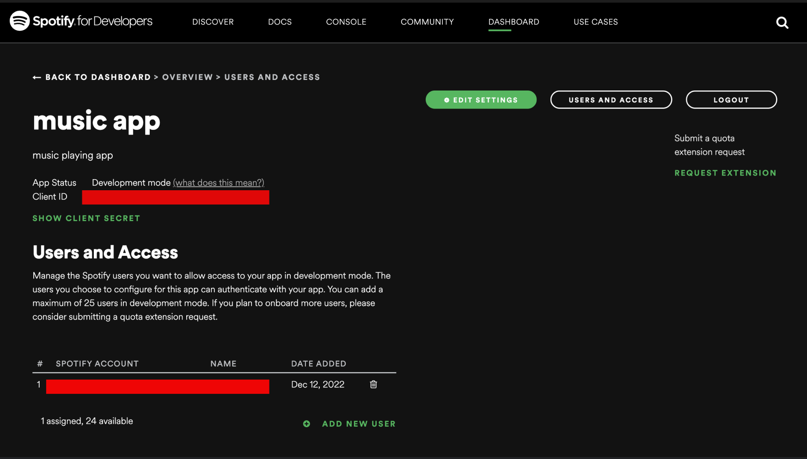

# What to Learn for contributing to Codepeak-Spotify Branch 

### Firstly - 
* Create a basic template of a music website:
    * NavBar
    * About Us Page
    * Search Bar to search for tracks
    * Componenet to display User Devices
    ```html
        <div class="device-cont">
            <select name="" id="devices">
                    // option tags with each user device
            </select>
        </div>
    ```
    * User Profile Page with componenets like:
    ```html
        <div class="profile-img-cont">
             // For User Profile Image
        </div>
        <div class="side">
            <div class="profile-text">PROFILE</div>
            <div id="profile-name"></div>            // For User Profile Name
        </div>
    ```
    * Dark/Light Mode Button, etc.

### After you are done making a basic template of your music player,
### You can start working with the Spotify API.

1. Go to the **[Spotify Developers Page](https://developer.spotify.com/)**
2. Click on **Dashboard**
3. **Log In** if you have an account, **Sign Up** if you don't.
4. After you're Logged In, click on **CREATE AN APP**, fill in the necessary details and click on **CREATE**
5. You'll see a page like this
   
6. Click on your App, and now you'll be able to see something like this
    
7. Now, the most important steps are:
    * Click on **USERS AND ACCESS** and then click on **ADD NEW USER**. Fill in the details.
    * After finishing this, click on **EDIT SETTINGS** and set the value of *REDIRECT_URI* as the URI of your Music Player HTML Page. In TARANA, the page is *index.html* and the URI is *http://127.0.0.1:5500/index.html*

Now, you can use the **CLIENT_ID** and **CLIENT_SECRET** for fetching data.

* You'll have to make an authentication page wherein the user can enter his/her CLIENT_ID and CLIENT_SECRET, then send an authorization request to Spotify.

* After Spotify authorizes the user, they'll be redirected to the **REDIRECT_URI** which is the Music Player.

* **You can follow [this](https://youtu.be/1vR3m0HupGI) YouTube tutorial to get some idea about the authorization process.**

* After you're done with this, now you can start fetching your TOP TRACKS, TOP ARTISTS, USER INFORMATION, ALBUMS, PLAYLISTS, RECOMMENDATIONS and many other things. **Check out [this](https://developer.spotify.com/documentation/web-api/reference/#/) page for all the URIs you can use to fetch different data.**

* You can also log the fetched data to the console to see all the different parameters in it.

Now, you can show the fetched data on screen.

For example :-<br/>
Show User Devices
```js
var data_devices = JSON.parse(this.responseText);
console.log(data_devices);
const devices = document.getElementById('devices');
data_devices.devices.forEach( device_ => {
    let node = document.createElement('option');
    node.value = device_.id;
    node.innerHTML = device_.name;
    devices.appendChild(node);
})
```
Show User Info
```js
var data_user = JSON.parse(this.responseText);
console.log(data_user);
const userimg = document.getElementById('userimg');
const username = document.getElementById('username');
const profileImg = document.querySelector('#profile-img');
const profileName = document.querySelector('#profile-name');
userimg.src = data_user.images[0].url;
profileImg.src = data_user.images[0].url;
profileName.textContent = data_user.display_name;
username.textContent = data_user.display_name;
```
And similarly, modify many other things.

**Contribute well 🚀**