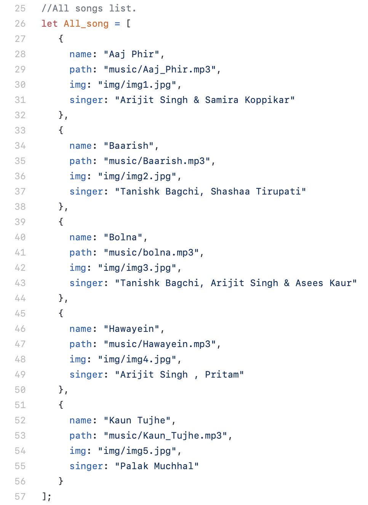

## Hii There,
    Here Is An Amazing Music Player You Can Use On Your PC.
    This Music Player Includes Play/Pause Button, Backword Button, Forward Button, Volume Slider, Mute Button, Music-Track Slider.

## How To Use 👇
    STEP 1-> First You've To Create Two Folder Named As "img" And "music", Type Carefully As It Is Case Sensitive.
    STEP 2-> Copy Image Of Your Song/Audio In Image Folder And Also Song/Audio In Music Folder.
    STEP 3-> Download The Code And Open Javascript File, Go To Line No. 25 And Here You've To Write Information Of Your Songs, I'm Providing An Image For Clarification.

   

    Here You Can See That You've To Fill Name Of Song, Path Of Song, Path Of Inage Of Song And Singer Ot The Song In The Same Manner That I'm Following.
    STEP 4-> Open "index.html" To Play Song.

## Music-Player
    This Player Looks Like 👇 Open Youe PC And Start Playing Songs 😉.
    

----------

#### Thanks!

Thank you for being here! You can find my other project **[here](https://github.com/Nihal-Priyadarshi?tab=repositories)**.

  

 Let's have a chat on 
 

	
	
	
	

